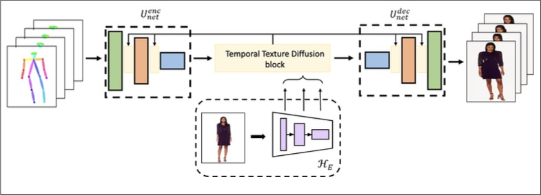
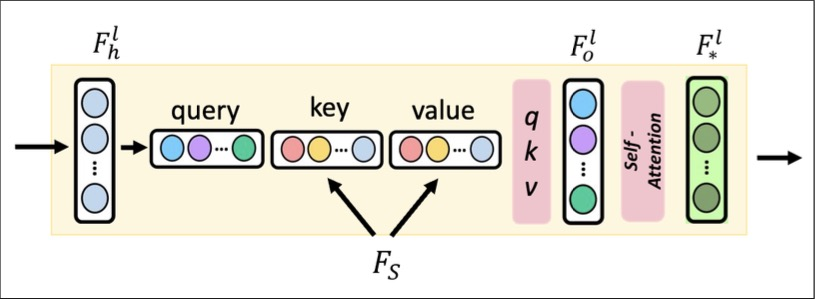
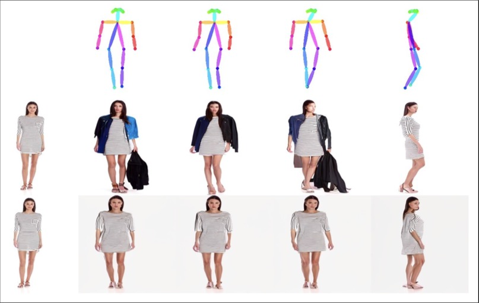
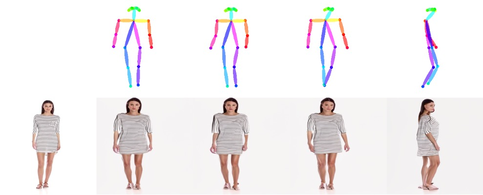
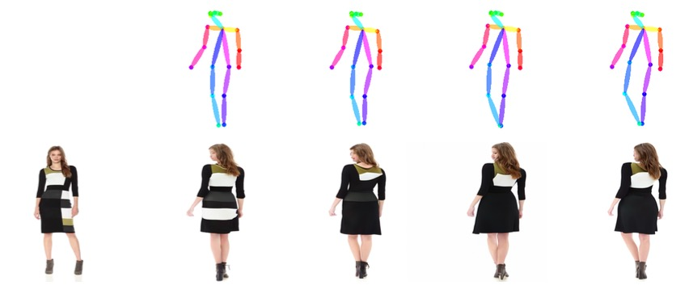
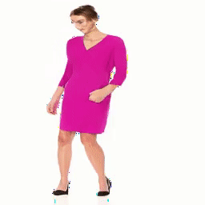

# PVDM

Person image synthesis is the task of generating realistic images of humans in various poses using pose guidance. There are several works involving generative adversarial networks, which can struggle to maintain realistic textures and handle complex deformations and occlusions. In this work, we extend the work titled “Person Image Synthesis via Denoising Diffusion Model” (PIDM) for person video synthesis. Specifically, in this work, we try to synthesise fashion videos using a pretrained person image diffusion model guided by a sequence of poses and a style image as in PIDM. We propose a temporal texture diffusion block that is an extension to the texture diffusion block proposed in PIDM. We add a self attention block on the space and time dimension separately that allows the UNet model to aggregate information from neighbouring frames to generate frame sequences that are temporally consistent and robust to artifact effects.

## Model Architecture
<table>
 <tr>
  <td align="center"></td>
</tr>
<tr>
  <td align="center"></td>
 </tr>
</table>

### Examples
<table>
 <tr>
  <td align="center"></td>
</tr>
<tr>
  <td align="center"></td>
</tr>
<tr>
  <td align="center"></td>
</tr>
<tr>
  <td align="center"></td>
</tr>
</table>